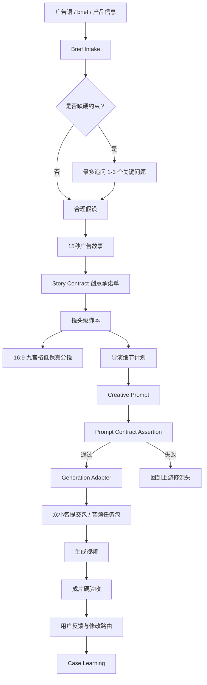

# FocusMedia Director Video Generator

从广告语、产品 brief、客户约束和素材出发，像广告导演一样生成一条分众电梯屏 TVC 的完整创作链路：故事、Story Contract、镜头脚本、导演细节计划、Creative Prompt、众小智提交任务包和生成后验收。

这个 Skill 适合“从 0 到 1 创作一条新广告片”。如果目标是从已有原片倒推复刻 prompt，应使用 `focusmedia-video-prompt-extractor`。

## 这个 Skill 解决什么问题

直接把广告语丢给视频模型，通常会出现几个问题：

- 画面像素材拼接，不像一条有导演意图的广告片。
- 口播被埋在长 prompt 里，生成时漏读、改读或顺序错。
- 产品、道具、声音、落版互相脱节，最后品牌记不住。
- 用户被迫回答镜头、景别、运镜这类专业问题，实际很难判断。

这个 Skill 的方法是：用户给策略和约束，Agent 负责导演表达。用户先看故事和画面方向，系统内部用结构化合同保证后续 prompt 不跑偏。

## Pipeline



## 工作方法

### 1. Brief Intake

提取真正影响执行的内容：

- 品牌和产品
- 广告语或必须保留文案
- 产品事实
- 消费者和场景
- 必须出现的资产
- 禁区和合规限制
- 语气、风格、客户偏好

只有品牌、产品、必须文案、禁区这类硬约束缺失时才追问。普通用户不需要回答景别、镜头运动、镜头数量。

### 2. 故事和 Story Contract

先写一版用户能看懂的 15 秒广告故事，让用户判断方向。

同时生成系统内部的 Story Contract，锁住：

- 必须出现的画面
- 产品和品牌露出方式
- 必读口播
- 必须出现的屏幕文字
- 声音承诺
- 禁区
- 不能丢失的主资产

故事负责感受，Contract 负责守约。

### 3. 镜头脚本和九宫格

正常 15 秒分众广告默认 8-12 个有效镜头，8-15 个可接受。

每个镜头必须承担一个广告功能：

- 开场钩子
- 品牌进入
- 产品证明
- 对比反差
- 大字锤击
- 使用结果
- 产品记忆
- 品牌收口

九宫格只是低保真视觉确认，不是 Seedance 参考图。

### 4. 导演细节计划

这是本 Skill 的关键能力，不只是把故事改写成 prompt。

#### Sound Plan 声音系统

包括：

- 连续音乐床
- VO 人设、口音边界、重音、停顿和收口
- 镜头级 SFX
- VO 出现时音乐让位
- 最后一帧的 sting 或尾音

#### Action Prop Plan 动作与道具逻辑

道具不能只是摆在画面里。每个关键道具要承担广告功能：

- 证明产品
- 引出下一个镜头
- 形成记忆点
- 服务品牌落版

#### Ending Contract 落版合约

最后不是简单 packshot，而是：

- 产品和品牌最终 lockup
- 最终必读 VO
- 最终屏幕文字
- 音乐 sting 或尾音延续
- 最后一帧前不能突然断音

### 5. Creative Prompt

最终 prompt 使用这个结构：

```text
全片目标

必读口播脚本
1. ...
2. ...

主体定义

声音计划

文字计划

动作与道具逻辑

镜头1
镜头2
镜头3
...

必要约束
```

关键规则：

- 必读口播必须单独置顶，不埋在声音计划里。
- 声音、文字、画面分开写。
- 一个镜头主要使用一种运镜。
- 情绪要通过具体动作表达。
- 负向约束少而准，不把每个历史坏 case 都塞进去。
- Creative Prompt 不写平台参数。

平台参数属于 Generation Adapter，例如众小智、Seedance、AI 视频 2.0、16:9、720p、mp4 下载链接、Prompt Rewrite。

### 6. Prompt Contract Assertion

生成前用脚本检查硬错误：

- 必读广告语是否漏掉
- 品牌收口是否漏掉
- 必读口播是否置顶
- 镜头数量是否太少
- 是否混入平台词或流程词
- 禁区是否被正向写入

如果断言失败，回到上游修 Story Contract、镜头脚本或 Prompt Builder，不在 prompt 末尾临时补一句。

### 7. Generation Adapter

当前 adapter 不伪造真实众小智远程 API。它负责生成本地提交任务包：

- prompt 文件
- manifest
- 提交清单
- 产品图和音频文件拷贝
- `seedance-output/`
- `validation/`
- 输出视频 ffprobe 和 contact sheet

如果后续拿到稳定的众小智 HTTP API 文档和鉴权方式，可以在 adapter 层替换，不影响 Creative Prompt 主流程。

## 使用方法

初始化一个 case：

```bash
node scripts/init_creative_case.js \
  --root "/path/to/project" \
  --case-id "brand-product-campaign" \
  --brief "广告语或 brief" \
  --brand "品牌" \
  --product "产品"
```

检查 Creative Prompt：

```bash
node scripts/assert_creative_prompt.js \
  --contract "/path/to/case/story_contract.json" \
  --prompt "/path/to/case/creative_prompt.md" \
  --out-json "/path/to/case/assertion_report.json" \
  --out-md "/path/to/case/assertion_report.md"
```

创建众小智视频提交包：

```bash
python3 scripts/seedance_job_adapter.py create-job \
  --payload "/path/to/payload.json" \
  --out-root "/path/to/jobs"
```

创建音频生成任务包：

```bash
python3 scripts/seedance_job_adapter.py audio-job \
  --payload "/path/to/payload.json" \
  --out-root "/path/to/audio-jobs"
```

清理 15 秒音频参考：

```bash
python3 scripts/seedance_job_adapter.py prepare-audio \
  --input "/path/to/raw.wav" \
  --output "/path/to/clean_15s.wav" \
  --duration 15
```

校验生成视频：

```bash
python3 scripts/seedance_job_adapter.py validate-output \
  --path "/path/to/output.mp4" \
  --validation-dir "/path/to/validation"
```

## Payload 示例

```json
{
  "jobName": "hujihua-gufaxiang",
  "strategy": "image_audio",
  "productName": "胡姬花古法小榨花生油",
  "slogan": "不是所有的香，都叫古法香。",
  "brandContext": "老字号花生油，强调古法小榨和香气记忆。",
  "productImagePath": "/path/to/product.jpg",
  "audioPath": "/path/to/audio_15s.wav",
  "voiceoverLines": "不是所有的香，都叫古法香。\n胡姬花。",
  "videoPrompt": "暖金棕老作坊，油线、花生、木榨和产品瓶形成记忆链。",
  "audioPrompt": "男声，有老字号广告感，重音清楚，最后品牌名有落点。",
  "duration": "15",
  "aspectRatio": "16:9",
  "resolution": "720p"
}
```

## 目录结构

```text
focusmedia-director-video-generator/
  SKILL.md
  README.md
  agents/openai.yaml
  references/
    pipeline-v0.1.md
    seedance-prompt-v0.1.md
    seedance-generation-adapter.md
    case-artifacts.md
  scripts/
    init_creative_case.js
    assert_creative_prompt.js
    record_learning_slice.js
    seedance_job_adapter.py
    test_*.js
```

## 验证

```bash
node scripts/test_assert_creative_prompt.js
node scripts/test_case_loop_scripts.js
python3 scripts/seedance_job_adapter.py --self-test
```

## 适用边界

适合：

- 从广告语或 brief 正向创作分众 TVC
- 生成导演级视频 prompt
- 生成众小智提交任务包
- 建立 case 学习闭环

不适合：

- 从已有原片倒推复刻 prompt
- 替代真实产品包装、Logo 和人物资产绑定
- 保证模型每次都准确生成中文文字、发音和产品细节
